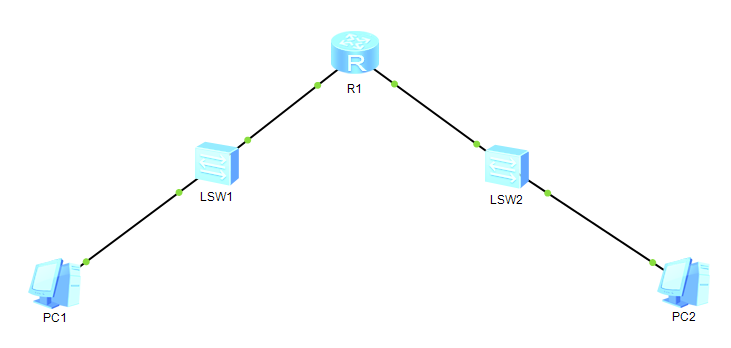
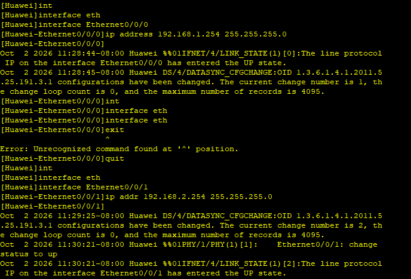
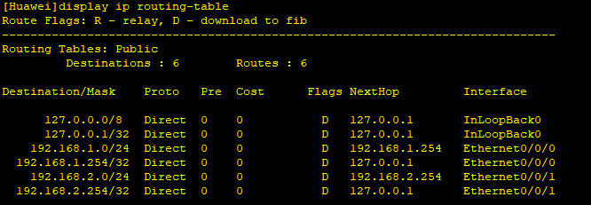
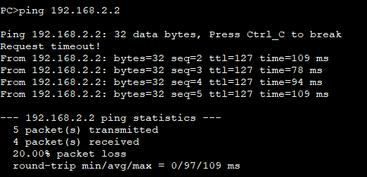
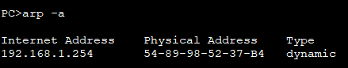
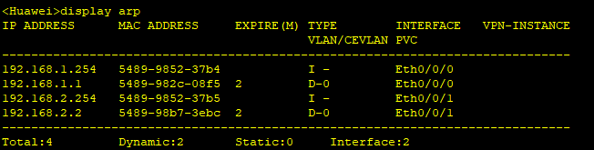
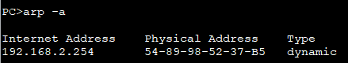

# Problem
    N2.1 proved that cross-subnet communication fails without a router: PC1 has no way to forward a packet to a destination outside its own subnet. NetLabOps needs an actual router in the topology to connect its subnets.

# Objective
    Add a router to the topology, connect it to both subnets, configure a default gateway on each PC, and get the cross-subnet ping working end-to-end.

# What I did
    * Added a router (AR series) to the existing eNSP topology, connecting PC1's subnet on one interface and PC2's subnet on the other.
    * Configured the router's interfaces: 192.168.1.254/24 facing PC1, 192.168.2.254/24 facing PC2.
    * Set PC1's default gateway to 192.168.1.254 and PC2's default gateway to 192.168.2.254.
    * Pinged PC1 -> router's own interface (192.168.1.254) first, before attempting the full cross-subnet ping.
    * Checked the router's routing table (display ip routing-table).
    * Pinged PC1 -> PC2 and observed the result packet by packet.
    * Checked the ARP tables on PC1 and on the router after the test.

# What worked vs what got stuck

## What worked
    * The intermediate ping (PC1 -> router interface) succeeded, confirming the local segment was correctly configured before testing the full path.
    * The full ping (PC1 -> PC2) succeeded overall.
    * The routing table showed both 192.168.1.0/24 and 192.168.2.0/24 as directly connected routes, without having typed any routing command - the router learns them automatically as soon as an interface is enabled with an IP address.

## What got stuck (and what I corrected)
    * The very first ICMP packet of the PC1 -> PC2 ping returned Request Time Out, while the following packets succeeded.
    * I first thought the ARP table of PC1 would end up containing PC2's MAC address. That was wrong: PC1 only ever needs the MAC address of its own gateway (the router's local interface) to send the packet - it never needs PC2's MAC, since PC2 is not on PC1's own subnet. Checking again, PC1's ARP table actually contained the router's IP and MAC address, not PC2's.
    * I also first said the router, generically, needed PC2's MAC address. That was imprecise: it is specifically the router's interface facing PC2's subnet (192.168.2.254) that resolves and holds PC2's MAC - the interface facing PC1 never needs it.
    * I initially said "one failed packet because ARP takes longer than a ping," without specifying how many ARP exchanges were actually involved. There were two separate ARP exchanges on two different network segments: PC1 <-> router (on the 192.168.1.0/24 segment) and router <-> PC2 (on the 192.168.2.0/24 segment). Both had to complete before the first ICMP packet could actually reach PC2 and come back, which took longer than the ping's timeout for that first packet.
    * On troubleshooting the general failure scenario ("PC1 can reach the router but not PC2"), I first listed only the default gateway as a possible cause. I completed the list with: the router's own interfaces (enabled and correctly configured), and the physical links in the topology actually being active (not disconnected) - a more precise term than "straight cable"; which actually refers to a specific Ethernet cabling type (straight-through vs crossover), not simply "connected".

# My reasoning
    I tested in order, from the smallest segment (PC1 -> router) to the full path (PC1-> PC2), instead of testing the full path directly - isolating exactly which segment would fail if anything went wrong. When the first packet timed out, I reasoned through the actual chain of ARP resolutions required end to end, rather than assuming a single generic "ARP delay", and verified my hypothesis directly against both PC's and the router's ARP tables instead of guessing.

# Final solution
    A working topology: PC1 (192.168.1.1/24) - Router (192.168.1.254 / 192.168.2.254) - PC2 (192.168.2.2/24), with correctly configured default gateways on both PCs. Successful end-to-end ping, with the first packet's timeout explained by two independent ARP resolutions (PC1<->router, router<->PC2) needing to complete before the first ICMP reply could return.

# English vocabulary
|French|English|
| :---: | :---:|
|passerelle par défaut|default gateway|
|table de routage|routing table|
|route directement connectée|directly connected route|
|saut (réseau)|hop|
|interface (routeur)|interface|
|câble droit/croisé|straight-through / crossover cable|
|lien actif|active link|

# Evidence

# Topology

# Router interface configuration 

# Router table output

# Full ping output showing the first Request Time Out

# Both ARP table screenshots
## PC1 ARP table

## Router ARP table

## PC2 ARP table
