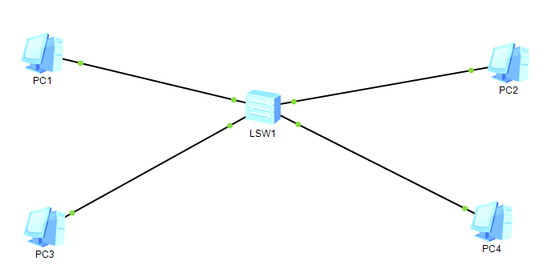
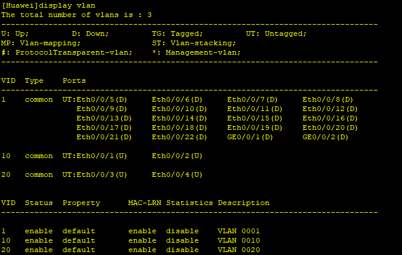
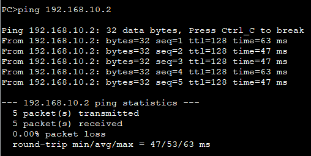
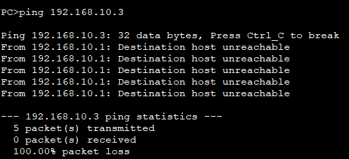

# Problem
    The network so far only had one logical space per physical cabling - every device shared the same broadcast domain regardless of role. A real company network needs to logically isolate different groups (users, admins, servers) on the same physical switch, without running separate cabling for each.

# Objective
    Create multiple VLANs on a switch, assign ports to each VLAN, and understand why machines in different VLANs cannot communicate even when they share the same IP subnet - before introducing any routing between them.

# What I did
    * Rebuilt the topology with a single switch and four PCs.
    * Created two VLANs on the switch: VLAN 10 (Users) and VLAN 20 (Admin).
    * Assigned access ports: Eth0/0/1 and Eth0/0/2 to VLAN 10 (PC1, PC2), Eth0/0/3 and Eth0/0/4 to VLAN 20 (PC3, PC4).
    * Gave all PCs an IP in the same subnet on purpose (192.168.10.0/24), to isolate VLAN behavior from any IP/subnet-mask effect already covered in N2.1.
    * Checked the switch's VLAN table with display vlan.
    * Pinged PC1 -> PC2 (same VLAN) and PC1 -> PC3 (different VLAN, same subnet), five packets each.
    * Checked PC1's ARP table after the failed cross-VLAN ping.

# What worked vs what got stuck

## What worked
    * dispaly vlan confirmed the configuration: VLAN 10 contains Eth0/0/1 and Eth0/0/2 (both Up, Untagged), VLAN 20 contains Eth0/0/3 and Eth0/0/4 (both Up, Untagged). Both VLANs enabled, in common mode.
    * PC1 -> PC2 (same VLAN): 5/5 packets received, 0% loss, round-trip 47-63ms.
    * PC1 -> PC3 (different VLAN): 5/5 packets lost, 100% loss. All five attempts returned the identical messae From 192.168.10.1: Destination host unreachable - a single consistent behavior across all five packets, not a mix of different error types as I first assumed.
    * PC1's ARP table after the failed test: empty. No entry was ever learned for 192.168.10.3.

## What got stuck (and what I corrected)
    * I initially thought the blocked traffic was related to 802.1Q VLAN tagging. That was incorrect: tagging only applies on trunk links between switches (or between a switch and a router). My ports are configured as access ports (shown as UT = untagged in display vlan), so no tag is ever added. The switch instead blocks the frame based on a simpler, internal mechanism: it knows which VLAN each port belongs to, and refuses to forward a frame from a VLAN 10 port to a VLAN 20 port - no tagging involved at all for access-to-access traffic.
    * I first said PC1 would "wait indefinitely" for an ARP reply that never comes. That was imprecise: a ping always has a fixed number of attempts (5 here) and a per-packet timeout, so it does stop - it just never receives any reply during those 5 attempts, unlike N2.2 where the first packet alone timed out before the (still successful) ARP resolution caught up.
    * The core distinction I had to work out between N2.1, N2.2 and this problem:
        * N2.1 (no gateway): PC1 itself locally decides the destination is off-link and never even attempts ARP - the error is immediate and self-generated.
        * N2.2 (router, first packet): PC1 does attempt ARP, resolution takes slightly longer than the ping's short timeout on the very first packet, then succeeds on subsequent packets.
        * N2.3 (different VLAN, same subnet): PC1 believes PC3 is on-link (same subnet/mask) and genuinely broadcasts an ARP request - but the switch silently drops it at the port level before it even reaches PC3. PC1 has no way to know this is happening; it simply never gets a reply, for all 5 attempts, and reports Destination host unreachable as a local fallback once every attempt in that ping run has failed.

# My reasoning
    I tested same-VLAN and cross-VLAN communication with identical IP addressing on purpose, to isolate VLAN filtering as the only variable - ruling out any subnet or gateway explanation from N2.1/N2.2. I verified the switch configuration (display vlan) before drawing conclusions from the ping output alone, and checked PC1's ARP table afterward to confirm no resolution had occurred at all, rather than assuming it from the ping result only.

# Final solution 
    Two VLANs configured on one switch (VLAN 10: PC1/PC2, VLAN 20: PC3/PC4), confirmed working blocked across VLANs (cross-VLAN ping fails completely, 100% loss, empty ARP table) - despite both VLANs sharing the same IP subnet. This demonstrates taht VLAN segmentation operates below the IP layer: a switch can isolate two devices  that would otherwise appear to belong to the same network from an IP standpoint.

# English vocabulary
|French|English|
| :---: | :---: |
| réseau local virtuel | virtual LAN (VLAN) |
| port d'accès | access port |
| port trunk | trunk port |
| étiquetage de trame (802.1Q) | frame tagging (802.1Q) |
| segmentation réseau | network segmentation |
| domaine de diffusion | broadcast domain |
| appartenance de port | port membership |

# Evidence

## Topology

## Switch VLAN configuration (display vlan)

## Ping results

### PC1 -> PC2 (192.168.10.2, same VLAN):

### PC1 -> PC3 (192.168.10.3, different VLAN, same subnet):
