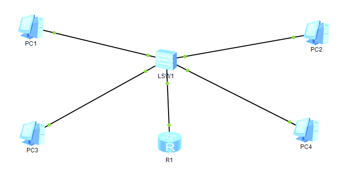
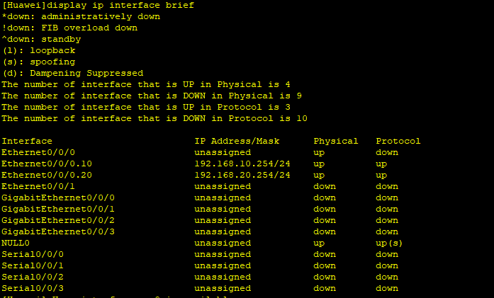
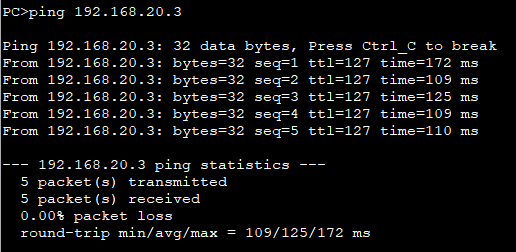

# Problem
    N2.3 proved that VLAN 10 and VLAN 20 are fully isolated at Layer 2, even sharing the same subnet. A real company network needs some of that traffic to cross between VLANs when legitimate (e.g. Admin reaching a server). A router is required to bridge that boundary.

# Objective
    Make PC1 (VLAN 10) and PC3 (VLAN 20) communicate through a router, using a single physical link between the switch and the router, split into subinterfaces - the router-on-a-stick technique.

# What I did
    * Reassigned VLAN 20 to its own subnet, 192.168.20.0/24 (PC3/PC4) while VALN 10 kept 192.168.10.0/24 (PC1/PC2) - deliberately different subnets this time, unlike N2.3's same-subnet test.
    * Connected the switch to the router with a single cable.
    * Configured the switch-facing port as a trunk, allowing VLAN 10 and VLAN 20.
    * Created two subinterfaces on the router's single physical interface, each with 802.1Q termination and its own IP:
        interface Ethernet0/0/0.10
          dot1q termination vid 10
          ip address 192.168.10.254 255.255.255.0
          arp broadcast enable
        
        interface Ethernet0/0/0.20
          dot1q termination vid 20
          ip address 192.168.20.254 255.255.255.0
          arp broadcast enable
    * Set PC1's default gateway to 192.168.10.254 and PC3's 192.168.20.254
    * Checked display ip interface brief on the router
    * Pinged PC1 -> PC3

# What worked vs what got stuck

## What worked
    * display ip interface brief confirms both subinterfaces are correctly configured and operational:
        * Ethernet0/0/0.10 -> 192.168.10.254/24, Physical up, Protocol up
        * Ethernet0/0/0.20 -> 192.168.20.254/24, Physical up, Protocol up
        * The parent physical interface Ethernet0/0/0 itself shows Physical up / Protocol down - expected, since the physical port carries no IP of its own; only its subinterfaces are configured with addresses, while the physical link to the switch is simply up.
    * Ping PC1 -> PC3 succeeded with 100% success - the two VLANs can now communicate through the router.

## What got stuck (and what I corrected)
    * I first explained the need for a trunk link vaguely, saying the port "accepts tagged or untagged frames that it may or may not let through". That description avoided the actual point. The precise reasoning: a trunk link carries multiple VLANs over a single physical cable, so each frame must carry an 802.1Q tag identifying which VLAN it belongs to - otherwise the router would have no way to know whether an incoming frame on that one shared cable came from VLAN 10 or VLAN 20. This is exactly why tagging, irrelevant on the access ports used through N2.3, becomes necessary here.

# My reasoning
    I deliberately moved VLAN 20 to a different subnet before testing, to avoid repeating N2.3's same-subnet special case and instead test a standard gateway-based scenario across VLANs. I verified the subinterfaces'status with display ip interface brief before testing the full ping, to confirm the Layer 3 configuration was sound independently of the ping result.

# Final solution
    PC1 (VLAN 10, 192.168.10.0/24) and PC3 (VLAN 20, 192.168.20.0/24) successfully ping each other through a single trunk link between the switch and the router, using two 802.1Q subinterfaces on the router's one physical interface - each acting as the default gatewy for its respective VLAN.

# English vocabulary
| French | English |
| :---: | :---: |
| sous-interface | subinterface |
| lien trunk | trunk link |
| VLAN autorisé (sur trunk) | allowed VLAN |
| trame | frame |

# Evidence

## Topology

## Display ip interface brief (router)

## Ping result
