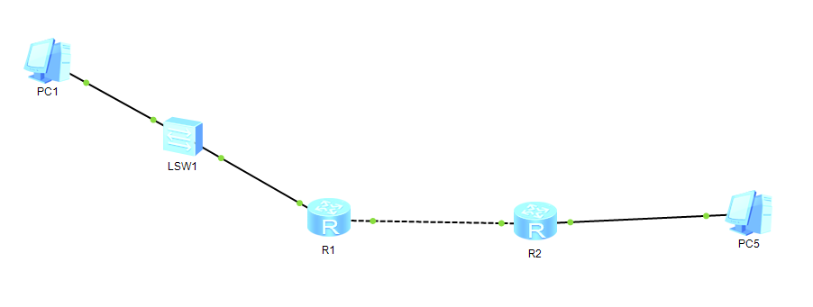
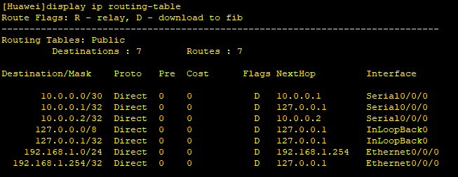
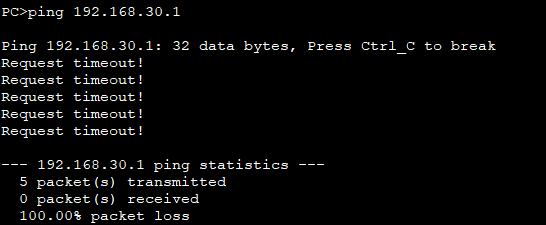
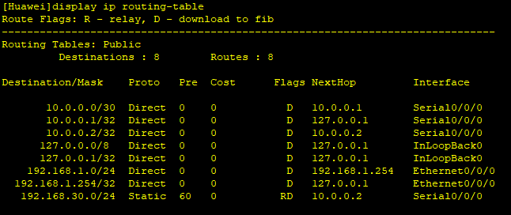
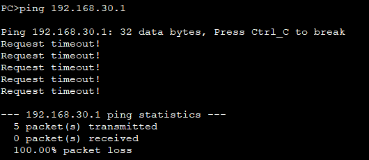
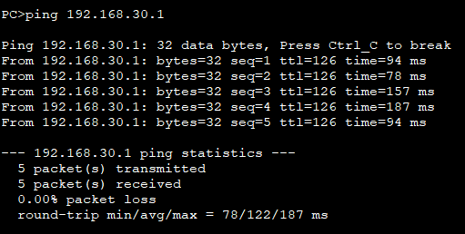
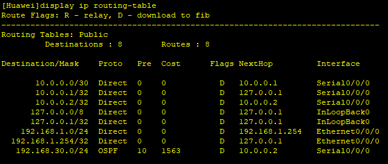
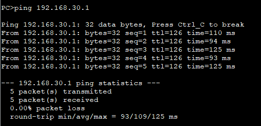

# Problem
    Until now, every router in the topology was directly connected to both networks it routed between, so routes appeared automatically (Direct) without any manual configuration. A real infrastructure has networks separated by multiple routers, where a router must learn to reach a network it is not itself attached to.

# Objective
    Add a second router, create a network unknown to the first router through any automatic route, make it reachable with a static route, then replace that static route with OSPF and compare the two approaches.

# What I did
    * Added a second router (R2), connected to R1 through a new point-to-point link, with a new subnet (192.168.30.0/24) behind R2 hosting PC5.
    * Checked display ip routing-table on R1 before any manual route: 192.168.30.0/24 did not appear, and the first ping PC1 -> PC5 failed, confirming R1 had no way to reach it.
    * Configured a static route on R1 toward 192.168.30.0/24, with the next hop set to the R1-R2 link IP on R2's side.
    * Tested the ping again: still failing at that point.
    * Configured the symmetric static route on R2, toward PC1's network, with the next hop set to the R1-R2 link IP on R1's side.
    * Tested the ping again: success.
    * Removed both static routes (undo ip route-static ...).
    * Enabled OSPF on R1 and R2, advertising their respective connected networks in area 0.
    * Checked display ip routing-table on both routers: the remote networks now appeared with protocol OSPF instead of Static.
    * Tested the ping PC1 -> PC5 again: success.

# What worked vs what got stuck

## What worked
    * The first static route (R1->R2's network) alone was not enough: the ping still failed.
    * Once I added the symmetric static route on R2 (->PC1's network), the ping succeeded in both directions.
    * After switching to OSPF, display ip routing-table on R1 showed PC5's network with protocol OSPF, confirming the static route had been correctly removed beforehand and OSPF was the one actually providing the route.
    * The final ping PC1->PC5 succeeded under OSPF exactly as it had under the static routes.

## What got stuck (and what I corrected)
    * My first explanation for why the ping still failed after only the first static route was imprecise: I said it was "so PC1 could know if the packet was received or not". The actual mechanism is more specific: PC5 does not receive the ICMP echo request from PC1 (R1's static route handles the forward path correctly). The failure happens on the return path - PC5 sends its echo reply toward R2, and R2, having no route back to PC1's network yet, drops that reply packet silently. PC1 never gets a response, not because it "doesn't know", but because the reply never makes it back at all.
    * On why OSPF requires matching areas between neighbors: I first only restated that "OSPF manages things in areas", without explaining the mechanism. The actual reasoning: an OSPF area is a membership label, not just an identifier - twor routers must declare the same area on a shared link to even form an OSPF neighbor relationship (an adjacency). If R1 advertises area 0 and R2 advertises a different area on that link, they do not become OSPF neighbors at all, and no routes are exchanged between them - comparable in effect (though not in mechanism) to the VLAN isolation seen in N2.3: a mismatch silently prevents the exchange of information rather than causing an explicit error.

# My reasoning
    I tested the static route one direction at a time instead of configuring both sides at once, which let me directly observe and explain the asymmetric failure (forward path working, return path dropped) rather than only seeing a final pass/fail result. Before switching to OSPF, I removed the static routes first and verified the routing table showed OSPF rather than Static for the remote network, to confirm OSPF - not a leftover static entry - was actually responsible for the working ping.

# Final solution 
    PC1 and PC5, separated by two routers (R1 and R2) with no direct connection between either router and the other's remote network, successfully ping each other - first via a pair of symmetric static routes (one per direction), then via OSPF after the static routes were removed, with the routing table confirming OSPF as the active source of the route in both directions.

# English vocabulary
| French | English |
| :---: | :---: |
| route statique | static route |
| saut suivant | next hop |
| routage dynamique | dynamic route |
| protocole de routage | routing protocol |
| zone (OSPF) | area |
| annoncer un réseau | advertise a network |
| relation de voisinage (OSPF) | adjacency |
| chemin retour | return path |

# Evidence

## Topology

## Routing table outputs before routes configuration

## First ping (failure)

## Routing table outputs after static routes configuration

## Second ping (failure missing return path configuration)

## First successful ping (with static routes)

## Routing table outputs after ospf

## Last ping successful
