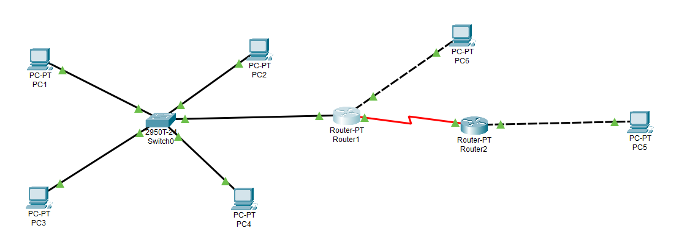
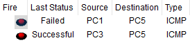
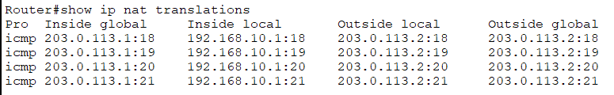

    Note on tooling: this problem was completed on Cisco Packet Tracer instead of eNSP. eNSP's generic "Router" model turned out not to support ACL commands at all, and attempting to switch to a real AR2220 model triggered a VirtualBox/Hyper-V environment error (VERR_SUPDRV_NO_RAW_MODE_HYPER_V_ROOT) that could not be resolved. The underlying concepts (ACL evaluation order, implicit deny, NAT/PAT) are identical; only the CLI syntax differs from Huawei VRP.

# Problem
The network so far lets any device reach any other device as long as a route exits. A real company network needs to restrict specific flows (e.g. Users VLAN should not reach a sensitive server) and needs to translate private addresses when traffic leaves toward the outside world.

# Objective
Write an ACL that selectively blocks one specific flow without breaking others, then configure NAT so a private network can reach an external network using a public address.

# What I did

## Part 1 - ACL
* Target: block ICMP from PC1 (192.168.10.1) to PC5(192.168.30.1) specifically, while leaving PC3 (192.168.20.3) -> PC5 unaffected.
* Identified the correct router and interface for the filter: P1, on the subinterface facing PC1's network (192.168.10.254), applied inbound - filtering as early as possible, right where the unwanted traffic enters the router, rather than later on an outbound interface.
* Wrote and applied the ACL:
    access-list 100 deny icmp host 192.168.10.1 host 192.168.30.1
    access-list 100 permit ip any any

    interface FastEthernet0/0.10
    ip access-group 100 in
* Tested both flows using Packet Tracer's Simulation mode.

## Part 2 - NAT (PAT / overload)
* Set up an external segment attached to the router, with a public address (203.0.113.1/24) representing the internal-facing "inside global" address, and an external host at 203.0.113.2.
* Configured NAT overload:
    access-list 1 permit 192.168.10.0 0.0.0.255

    interface FastEthernet0/0.10
    ip nat inside

    interface FastEthernet1/0
    ip nat outside

    ip nat inside source list 1 interface FastEthernet1/0 overload
* Pinged from PC1 toward the external host (203.0.113.2) and checked show ip nat translations.
  

# What worked vs what got stuck

## What worked
* The ACL blocked exactly the targeted flow: PC1->PC5 showed Failed, while PC3->PC5 showed Successful in the same situation run - confirming the rule was precise, not a blanket block.
* show ip nat translations confirmed the expected behavior. PC1's private address (192.168.10.1) was consistently translated to the router's public address (203.0.113.1), with a distinct port per ICMP packet.

## What got stuck (and what I corrected)
* I initially suspected a missing step equivalent to Huawei's arp broadcast enable when inter-VLAN routing didn't work at first on the new subinterfaces. That assumption was wrong: arp broadcast enable is specific to Huawei VRP's dot1q termination subinterface model and has no Cisco equivalent - Cisco subinterfaces resolve ARP automatically once encapsulation and IP are correctly configured. The actual fix ended up being routing-related (switched from a planned RIP configuration to static routes between R1 and R2, which worked more directly for this topology).
* My first explanation for why NAT tracks ports, not just IP addresses, was imprecise ("the port gives the packet's route, and avoids a bottleneck at the router"). The actual reason: with NAT overload, multiple internal hosts share a single public IP address. If only the IP were tracked, the router would have no way to know which internal host a returning reply belongs to once several hosts use the same public address at the same time. The IP + Port combination is what uniquely identifies each internal host's session - this is exactly what PAT (Port Address Translation) means, and it is confirmed directly in the translation table, where each ICMP packet gets a distinct port (18, 19, 20, 21) even though the source IP is always the same.
   
# My reasoning
I chose to filter inbound on the interface closest to the sourcde of the unwanted traffic (R1's subinterface facing PC1), rather than outbound closer to the destination, to reject the packet as early as possible and avoid unnecessary processing. I deliberately kept the final permit ip any any line and tested the unaffected flow (PC1->PC5), rather than only checking that the targeted flow failed - verifying that the rest of the network still works is the real test of a precise ACL.

# Final solution
An ACL on R1 that blocks ICMP from PC1 to PC5 specifically while leaving all other traffic (including PC3->PC5) unaffected, and a working NAT overload configuration that translates PC1's private address to the router's public address, confirmed by the translation table showing distinct portd per session.

# English vocabulary
|French|English|
|:---:|:---:|
|liste de contrôle d'accès|access control list (ACL)|
|autoriser/refuser|permit/deny|
|refus implicite|implicit deny|
|traduction d'adresse|network address translation (NAT)|
|surcharge NAT (PAT)|NAT overload / PAT|
|adresse publique/privée|public/private address|
|traduction de port|port translation|

# Evidence

## Network Topology

## Simulation panel 

## IP + Port translation
