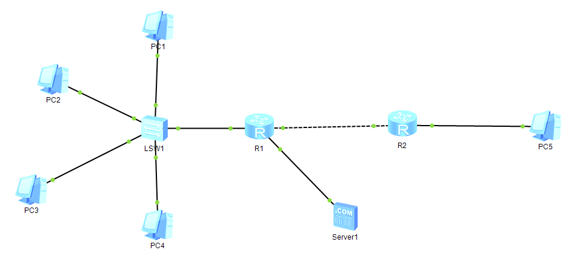
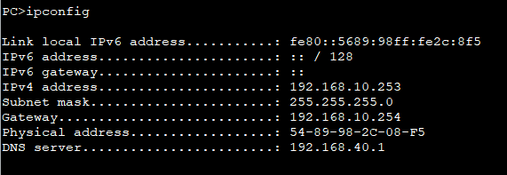
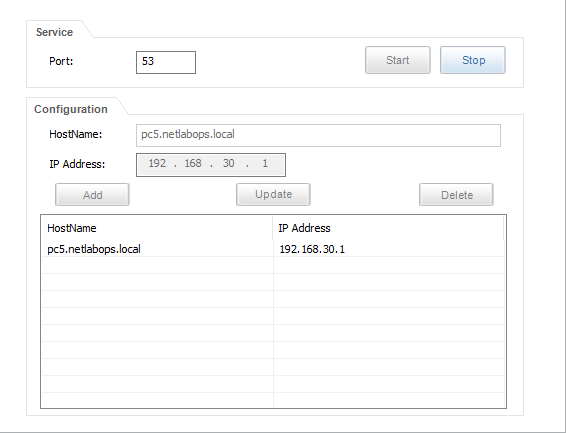
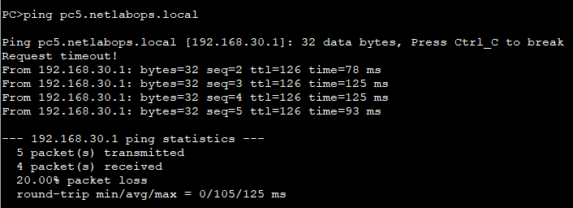

# Problem
Every PC in the topology had been configured with a static IP by hand so far - viable for 5 machines, completely unrealistic for a real company with dozens of hosts. Also, every test so far used raw IP addresses - no human-readable name had ever been used.

# Objective
Configure the router itself as a DHCP server so PCs obtain their IP configuration automatically, then set up a DNS server so hosts can be reached by name instead of by IP.

# What I did

## DHCP (router as server)
* Enabled DHCP globally on R1 and created two address pools, one per VLAN:
    dhcp enable

   ip pool pool10
    gateway-list 192.168.10.254
    network 192.168.10.0 mask 255.255.255.0
    dns-list 192.168.40.1

   ip pool pool20
    gateway-list 192.168.20.254
    network 192.168.20.0 mask 255.255.255.0
    dns-list 192.168.40.1
* Enabled dhcp select global on both subinterfaces (.10 and .20).
* Reasoned through why no DHCP relay was needed here, unlike a scenario with an external DHCP server and is already present on both subnets through its own subinterfaces, there is no broadcast domain it needs to cross on behalf of a client - relay only becomes necessary when the server is a separate host unreachable by broadcast from the client's subnet.
* Switched PC1-PC4 to DHCP and confirmed each obtained a correct IP, mask, gateway, and DNS server address.

## New network for the DNS server
* Used a free physical interface on R1, assigned it 192.168.40.254/24.
* Verified this new network did not automatically appear on R2's routing table (expected - no routing protocol knew about it yet), then advertised it under OSPF area 0 on R1, and confirmed it appeared on R2 as an 0 (OSPF) route.
* Connected a server to this new segment, intended to run as the DNS server at 192.168.40.1.

## DNS
* Enabled the DNS service on the server (port 53) and created an A record: pc5.netlabops.local -> 192.168.30.1.
* Tested ping pc5.netlabops.local from PC1.

# What worked vs what got stuck

## What worked
* The DHCP pools worked correctly from the start: all four PCs obtained the right addressing automatically.
* The new DNS server's network was correctly advertised through OSPF once added - confirmed on R2's routing table.
* The ACL and NAT from N2.6 remained unaffected by these changes, confirming they were configured independently of addressing changes elsewhere.

## What got stuck (and what I corrected) - a three-layer troubleshooting chain
The DNS resolution test failed for a long stretch, with the symptom "Destination host unreachable" and, more tellingly, no IP address at all displayed on the ping's first line - meaning resolution itself was falling, not the ping afterward. Diagnosing this required checking three independent thins, one at a time, rather than assuming a single cause:
    1. A typo in the DNS server's own IP address. The server's Local Address field was set to 192.164.40.1 instead of 192.168.40.1 - asingle transposed digit in the third octet. This meant the server was not actually on the 192.168.40.0/24 network that had been created and advertised in OSPF; it was sitting on an unrelated, unreachable network. This was confirmed by the server's own built-in ping test toward its gateway (192.168.40.254) returning 0% success before the fix, and 100% success immediately after correcting the IP.
    2. The DNS service needed restarting after the IP fix. Even after correcting the address, the service had to be explicitly stopped and restarted - a service already running with the old (wrong) address did not automatically pick up the correction.
    3. DHCP leaves already issued before the fix did not update automatically. PC1 had obtained its lease (including the dns-list value) before the server's IP was corrected, so simply fixing the server did not change what PC1 already had catched. Releasing and renewing PC1's DHCP lease was necessary before its DNS Server field reflected the corrected address.
Only once all three were addressed - correct server IP, restarted service, and a renewed lease - did ping pc5.netlabops.local from PC1 finally succeed, resolving to 192.168.30.1 and completing a normal ping to PC5.
A secondary confusion along the way: an attempt to test resolution by "giving PC1 a domain name" and querying it from PC2 does not test DNS at all - a PC is not a DNS server and cannot answer name resolution queries on its own. The correct test was to create the A record on the actual DNS server (Server1) and query it from any client with the right DNS server configured - which is what ultimately worked once isolated back to testing directly from PC1.

# My reasoning
Rather than accepting "it doesn't work" as one problem, I isolated it layer by layer: first confirmed the server was reachable at all (ping test to its own gateway), then confirmed the service was actually running, then confirmed the requesting client had the correct DNS address cached - rather than assuming the first thing I checked was the actual cause. Testing from PC1 specifically (already confirmed to have correct IP, gateway, DNS, and reachability to both the DNS server's network and PC5) rather than continuing to test from PC2 helped isolate the final cause instead of chasing two unknowns simultaneously.

# Final solution
R1 configured as a DHCP server distributing correct addressing (including DNS) to both VLANs; a DNS server reachable through OSPF on its own dedicated subnet, serving A records for PC5 and PC1; and a successful name-based ping from PC1 to PC5, confirming resolution and connectivity both work end to end.

# English vocabulary
|French|English|
|:---:|:---:|
|bail(DHCP)|lease|
|relais DHCP|DHCP relay|
|enregistrement (DNS)|record|
|résolution de nom|name resolution|
|octet (adresse IP)|octet|
|isoler une cause|isolate a cause|

# Evidence

## Network topology

## PC1 ipconfig

## DNS server's A records

## Successful ping pc5.netlabops.local output from PC1
